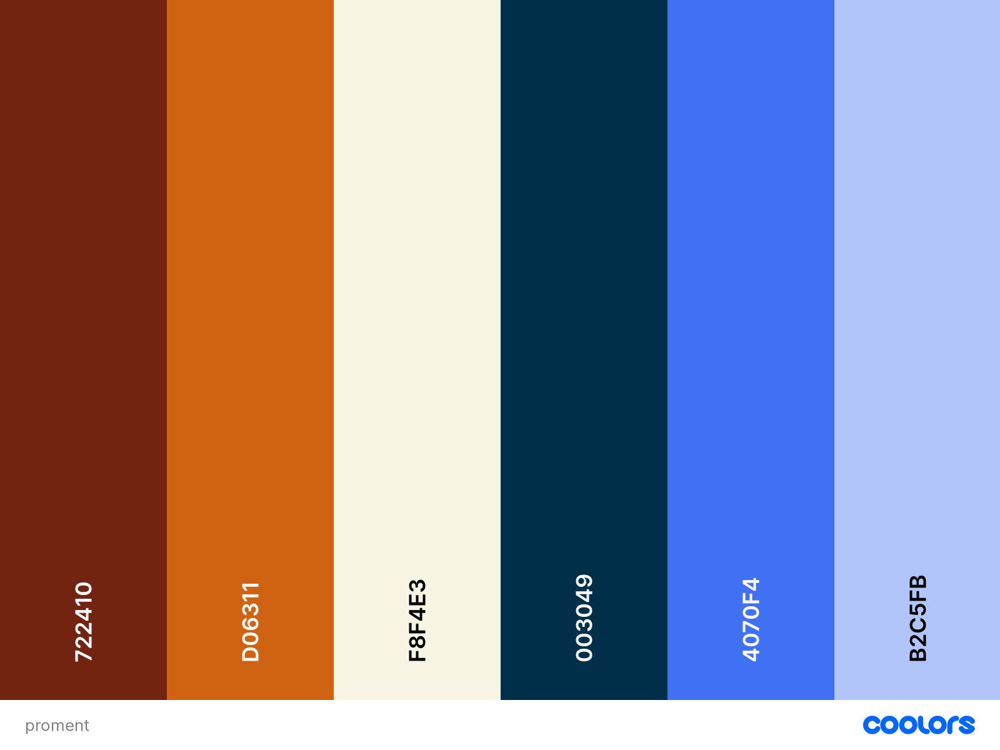

# KodeGo WD19P
## Repository for Project 2

## Group 10
## Members:
- Joven Moralejo
- Kathrina Reyes
- Glennson Madeja

## **Project Defaults**

### **1. Logo**

- "proment" word with check mark on "o"
- access it here [./assets/proment.png](./assets/proment.png)

### **2. Favicon**

- the letter "o" from proment with a check mark
- access it here: [./assets/favico.ico](./assets/favico.ico)

### **3. Font**
- font used is Kollektif, the same font used in the logo
- can be added to your pages by adding the brand.css
- access it here: [./assets/css/brand.css](./assets/css/brand.css)
- currently available font classes:
   + .proment-regular
   + .proment-bold
   + .proment-bold-italic
   + .proment-italic

### **4. Color Palette**

- primary color is orange
- secondary color is blue
- access it from coolors website: [Proment Color Palette](https://coolors.co/722410-d06311-f8f4e3-003049-4070f4-b2c5fb)
